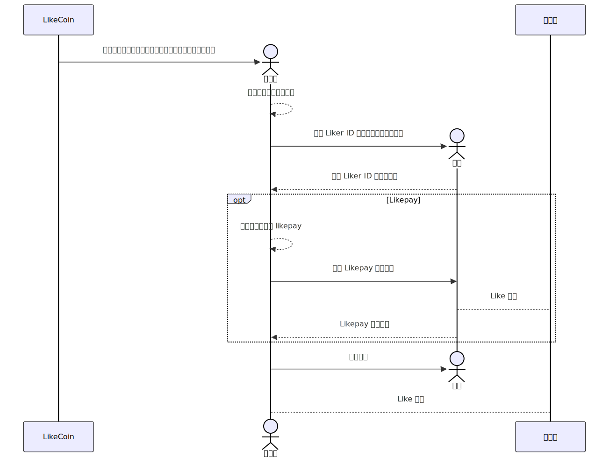

LikeCoin 作為一個旨在支持創作者的區塊鏈項目，其經濟模式的設計與創作者收入息息相關。儘管有人認為 LikeCoin 的重心已轉向 Web3 出版和 NFT 電子書，但 LikeCoin Button 及其相關應用仍然是許多個人 網站創作者的主要收入來源。然而，目前 LikeCoin 經濟模式的透明度和創作者收入穩定性存在一些值得關注的問題。

# 透明度問題：黑箱狀態下的創作基金分配數據

首先，LikeCoin Button 作為創作者賺取 Like Token 的主要途徑，其收益卻不穩定，波動幅度很大。

根據官方說明，創作者通過 LikeCoin Button 賺取的收入主要來自讚賞公民的委託回報和「創作基金」的分配。

https://docs.like.co/zh/general-guides/dapp/civic-liker/creators-fund

然而，這些關鍵數據目前處於黑箱狀態。創作基金的現況報告自 2023 年 6 月後便未更新，用戶鑫大叔製作的創作基金排行榜也停止運作。

https://blog.like.co/zh/category/%e7%a4%be%e7%be%a4/

https://lookerstudio.google.com/reporting/46dfd4ba-e742-4d0a-8b50-d56036e32cf5/page/p_b5fksgpftc?s=mn4s-X-VN4w

這種資訊不透明的情況使得用戶難以掌握最新的分配情況，也讓創作者難以準確預估收入，進而影響其創作意願。這種情況早在 2020 年就已受到批評，但至今仍未改善。

https://matters.town/a/z0v2s2mco7rw

為了促進創作生態的健康發展，公開透明的數據至關重要。我希望 LikeCoin 能在 Liker.Land app 或其他官方平台上提供詳細、及時的資訊，以便用戶隨時查閱。

# 收入穩定性問題：Like Token 價格波動與 Like Pay 的應用限制

除了資訊不透明外，創作者的收入還受到 Like Token 在交易所價格波動的影響，這增加了創作者收入的不穩定性。此外，創作者普遍傾向將 Like Token 兌換為現金或其他價值更高的虛擬貨幣，導致資金外流。儘管 LikeCoin 提供將 Like Token 委託給驗證人以賺取更多 Like Token 的選項，但在 Like Token 價格不穩定的情況下，創作者更傾向兌換 Like Token ，進而加劇幣值下跌，形成資金持續外流的惡性循環。

為了提高創作者收入的穩定性，我希望 LikeCoin 可以參考 Vtuber 的抖內/贊助模式，開發使用 Like Pay 賺取固定數量 Like Token 的插件，這樣可以降低創作者的風險，吸引更多創作者加入 LikeCoin 生態。如果 LikeCoin 提供使用 Like Pay 直接贊助作者的選項，讀者需先經由交易所購入 Like Token ，這將形成穩定的買盤，平衡供需關係，進而穩定其價格，減少 Like Token 在交易所價格波動對創作者收入的影響。

然而，目前 Like Pay 的應用範圍有限，僅能在 Matters 等特定創作平台上使用，無法像 LikeCoin Button 一樣在個人網站上廣泛使用。

https://docs.like.co/developer/like-pay/web-widget/reference
