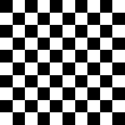

# Checkerboard


```
$color1 = [0,0,0];
$color2 = [1,1,1];

## Number of subdivisions in each direction
$subdiv = 10; # 2, 100

## Calculate integer coordinates based on subdivisions
$ix = floor($u * $subdiv);
$iy = floor($v * $subdiv);

## Checkerboard pattern using modulo operator
if (($ix + $iy) % 2 == 0)
{
	$color = $color1;
}
else
{
    $color = $color2;
}

$color
```