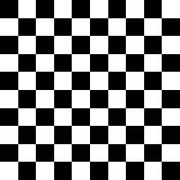
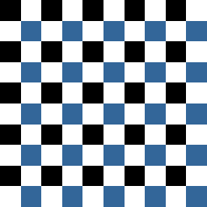
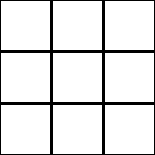
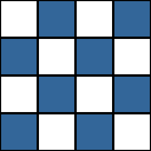

# Checkerboard


```
# Colour
$color1 = [0,0,0];
$color2 = [1,1,1];  

# Number of subdivisions in each direction

$xSubdiv = 10; # 2, 100
$ySubdiv = 10; # 2, 100  

# Calculate integer coordinates based on subdivisions

$ix = floor($u * $xSubdiv);
$iy = floor($v * $ySubdiv);

# Checkerboard pattern using modulo operator

if (($ix + $iy) % 2 == 0)
{
$color = $color1;
}
else
{
$color = $color2;
} 

$color
```

## Checkerboard Advance

```
# Colour
$color1 = [0.0, 0.0, 0.0]; # color
$color2 = [1.0, 1.0, 1.0]; # color

# Transformation Controls
$scale_horizontal = 10.0; # 1.0, 50.0
$scale_vertical = 10.0;   # 1.0, 50.0

$offset_horizontal = 0.0; # -1.0, 1.0
$offset_vertical = 0.0;   # -1.0, 1.0

$rotation = 0.0; # 0.0, 360.0
$shear = 0.0;    # -2.0, 2.0

# Rotation Matrix
$angleRad = rad($rotation);
$cosA = cos($angleRad);
$sinA = sin($angleRad);

# Center coordinates around (0.5, 0.5) to rotate from the middle
$uCent = $u - 0.5;
$vCent = $v - 0.5;

$rotU = $uCent * $cosA - $vCent * $sinA + 0.5;
$rotV = $uCent * $sinA + $vCent * $cosA + 0.5;

# Shearing
$shearedU = $rotU + ($shear * $rotV);
$shearedV = $rotV;

# Tiling and Global Offsets
# Multiply by scale to ensure higher numbers create more repetitions
$scaledX = ($shearedU + $offset_horizontal) * $scale_horizontal;
$scaledY = ($shearedV + $offset_vertical) * $scale_vertical;

# Use floor to get discrete integer grid cell IDs
$cellX = floor($scaledX);
$cellY = floor($scaledY);

# Checkerboard Checker (Safe Alternative to %)
# If the sum of the coordinates is even, use color1, else color2
$isEven = fmod(abs($cellX + $cellY), 2.0) < 1.0;

# Output
$isEven ? $color1 : $color2
```



```
# Colors
$color1_A = [0.0, 0.0, 0.0]; # color
$color1_B = [0.2, 0.4, 0.6]; # color
$color2   = [1.0, 1.0, 1.0]; # color

# Transformation Controls
$scale_horizontal = 10.0; # 1.0, 50.0
$scale_vertical = 10.0;   # 1.0, 50.0

$offset_horizontal = 0.0; # -1.0, 1.0
$offset_vertical = 0.0;   # -1.0, 1.0

$rotation = 0.0; # 0.0, 360.0
$shear = 0.0;    # -2.0, 2.0

# Rotation Matrix
$angleRad = rad($rotation);
$cosA = cos($angleRad);
$sinA = sin($angleRad);

$uCent = $u - 0.5;
$vCent = $v - 0.5;

$rotU = $uCent * $cosA - $vCent * $sinA + 0.5;
$rotV = $uCent * $sinA + $vCent * $cosA + 0.5;

# Shearing
$shearedU = $rotU + ($shear * $rotV);
$shearedV = $rotV;

# Tiling and Global Offsets
$scaledX = ($shearedU + $offset_horizontal) * $scale_horizontal;
$scaledY = ($shearedV + $offset_vertical) * $scale_vertical;

$cellX = floor($scaledX);
$cellY = floor($scaledY);

# Grid Logic
# Determine the primary checkerboard mask
$isColor1 = fmod(abs($cellX + $cellY), 2.0) < 1.0;

# Determine which sub-color to use for color1 based on the X cell ID
$useColor1A = fmod(abs($cellX), 2.0) < 1.0;
$chosenColor1 = $useColor1A ? $color1_A : $color1_B;

# Output
$isColor1 ? $chosenColor1 : $color2
```

# Grid Relative


```
# Colors
$linesColor = [0, 0, 0]; # color
$backgroundColor = [1.0, 1.0, 1.0]; # color

# Grid Configuration
$xSubdiv = 3; # 1, 50
$ySubdiv = 3; # 1, 50

$xOffset = 0.0; # -1.0, 1.0
$yOffset = 0.0; # -1.0, 1.0

# Relative line thickness (0.0 = invisible, 0.5 = fills half the cell)
$lineThickness = 0.05; # 0.0, 0.2

# Core Logic
# 1. Apply relative offset to our normalized UV coordinates
$uCoord = $u - $xOffset;
$vCoord = $v - $yOffset;

# 2. Scale coordinates by subdivisions and find local position within the cell
# fmod(position, 1.0) returns a value from 0.0 to 1.0 for every cell repeat
$localX = fmod($uCoord * $xSubdiv, 1.0);
$localY = fmod($vCoord * $ySubdiv, 1.0);

# Handle negative offsets safely so the grid repeats seamlessly
if ($localX < 0.0) { $localX += 1.0; }
if ($localY < 0.0) { $localY += 1.0; }

# 3. Determine if current position falls within the line thickness threshold
# Centering the line slightly by checking both ends of the cell interval
$halfThickness = $lineThickness / 2.0;
$insideX = ($localX < $halfThickness) || ($localX > (1.0 - $halfThickness));
$insideY = ($localY < $halfThickness) || ($localY > (1.0 - $halfThickness));

# Output
# If we are inside an X line OR a Y line, paint the grid line color
$insideX || $insideY ? $linesColor : $backgroundColor
```


```
# Colors
$linesColor = [0.0, 0.0, 0.0]; # color
$checkColorA = [1.0, 1.0, 1.0]; # color
$checkColorB = [0.2, 0.4, 0.6]; # color

# Grid Configuration
$xSubdiv = 4; # 1, 50
$ySubdiv = 4; # 1, 50

$xOffset = 0.0; # -1.0, 1.0
$yOffset = 0.0; # -1.0, 1.0

# Relative line thickness (0.0 = invisible, 0.5 = fills half the cell)
$lineThickness = 0.05; # 0.0, 0.2

# Core Logic
# 1. Apply relative offset to our normalized UV coordinates
$uCoord = $u - $xOffset;
$vCoord = $v - $yOffset;

# 2. Track the global scaled values to determine unique Cell IDs
$scaledX = $uCoord * $xSubdiv;
$scaledY = $vCoord * $ySubdiv;

# Get the integer cell coordinates
$cellX = floor($scaledX);
$cellY = floor($scaledY);

# 3. Find the local position within the cell (0.0 to 1.0) for the grid lines
$localX = fmod($scaledX, 1.0);
$localY = fmod($scaledY, 1.0);

# Handle negative offsets safely so the grid repeats seamlessly
if ($localX < 0.0) { $localX += 1.0; }
if ($localY < 0.0) { $localY += 1.0; }

# 4. Determine if current position falls within the line thickness threshold
$halfThickness = $lineThickness / 2.0;
$insideX = ($localX < $halfThickness) || ($localX > (1.0 - $halfThickness));
$insideY = ($localY < $halfThickness) || ($localY > (1.0 - $halfThickness));
$isGridLine = $insideX || $insideY;

# 5. Checkerboard Calculation
# Check if the sum of the grid coordinates is even
$isEvenTile = fmod(abs($cellX + $cellY), 2.0) < 1.0;
$dynamicBackground = $isEvenTile ? $checkColorA : $checkColorB;

# Output
# Prioritize the grid lines, otherwise show the checkerboard background
$isGridLine ? $linesColor : $dynamicBackground
```